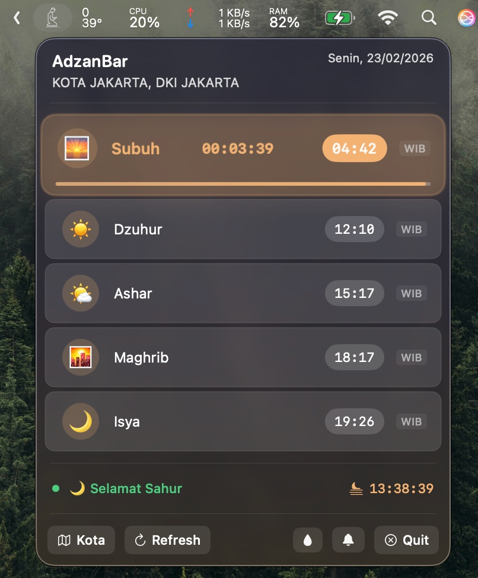
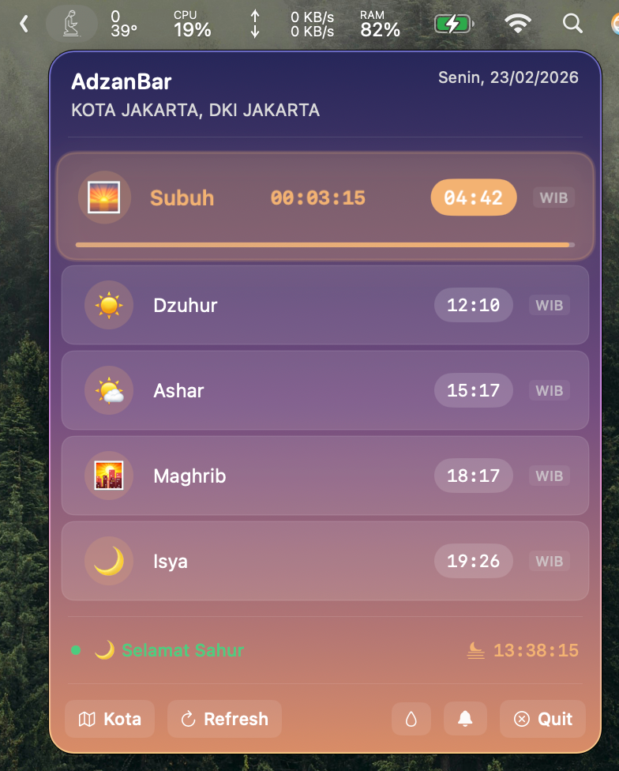
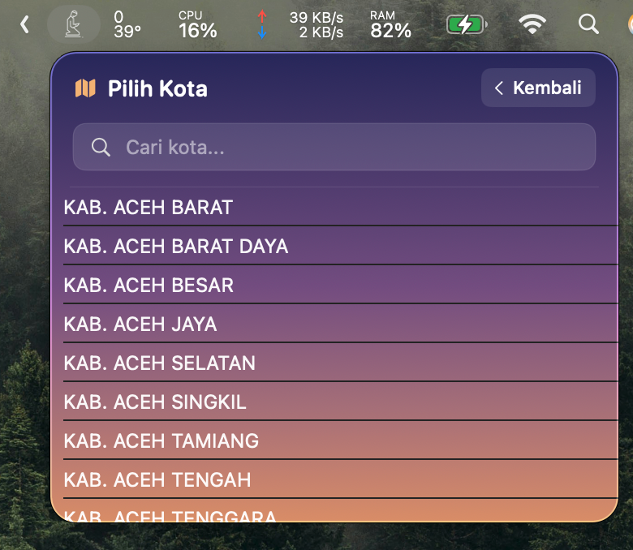

# 🌙 AdzanBar

> Menu bar widget jadwal sholat untuk macOS — ringan, akurat, dan tidak mengganggu.


---

## 📸 Screenshot

<table>
  <tr>
    <td align="center">
      <br/>
      <strong>Glass Mode</strong><br/>
      <sub>Transparent + Blur</sub>
    </td>
    <td align="center">
      <br/>
      <strong>Gradient Mode</strong><br/>
      <sub>Solid Background</sub>
    </td>
    <td align="center">
      <br/>
      <strong>City Picker</strong><br/>
      <sub>500+ Cities</sub>
    </td>
  </tr>
</table>

---

## ✨ Fitur Utama

### 🕌 Jadwal Sholat Akurat
- ✅ 5 waktu sholat (Subuh, Dzuhur, Ashar, Maghrib, Isya)
- ✅ Support 3 zona waktu Indonesia (WIB, WITA, WIT)
- ✅ Auto-detect timezone berdasarkan kota
- ✅ Update otomatis setiap hari

### 🔔 Smart Notifications
- ⏰ **5 menit sebelum Subuh** — Pengingat sahur segera berakhir
- 🌅 **5 menit sebelum Maghrib** — Persiapan berbuka
- 🍽️ **Tepat Maghrib** — Notifikasi waktu berbuka tiba
- ✅ Toggle ON/OFF untuk setiap notifikasi
- ✅ Persistent settings (tersimpan di preferences)

### 💾 Offline Mode dengan 7-Day Cache
- ✅ Cache jadwal sholat selama **7 hari**
- ✅ Tetap berfungsi tanpa internet
- ✅ Auto-refresh saat koneksi tersedia
- ✅ Hemat bandwidth dan API calls

### 🎨 Dynamic Theme
- ✅ **7 tema otomatis** sesuai waktu:
  - 🌅 Dawn (04:00-06:00)
  - ☀️ Morning (06:00-10:00)
  - 🌤 Midday (10:00-14:00)
  - ⛅ Afternoon (14:00-16:30)
  - 🌇 Sunset (16:30-18:30)
  - 🌆 Evening (18:30-20:00)
  - 🌙 Night (20:00-04:00)
- ✅ **Glass Mode** — Background transparan dengan blur effect
- ✅ Smooth gradient transitions

### 🍽️ Ramadan Mode
- ✅ **Selamat Sahur** (00:00 - Subuh) 🌙
- ✅ **Selamat Berpuasa** (Subuh - Maghrib) ☀️
- ✅ **Selamat Berbuka** (Maghrib - Isya) 🍽️
- ✅ **Selamat Tarawih** (Isya - 23:59) 🕌
- ✅ Countdown Maghrib real-time

### 🏙️ Multi-City Support
- ✅ 500+ kota di Indonesia
- ✅ Search kota dengan cepat
- ✅ Switch kota dengan mudah
- ✅ Auto-save kota terakhir

---

## 🚀 Instalasi

### Option 1: Build dari Source (Recommended)

```bash
# Clone repository
git clone https://github.com/bennu7/prayer-times-swift.git

# Buka di Xcode
cd prayer-times-swift/AdzanBar
open AdzanBar.xcodeproj

# Build & Run (⌘ + R)
```

### Option 2: Download Release

Download file `.app` dari [Releases](https://github.com/bennu7/prayer-times-swift/releases) page.

---

## 📋 Requirements

- **macOS** 13.0 (Ventura) atau lebih baru
- **Xcode** 15.0+ (untuk build dari source)
- **Swift** 5.9+

---

## 🎯 Cara Penggunaan

### First Launch
1. Build & run di Xcode
2. App akan muncul di **menu bar** (kanan atas)
3. App **tidak muncul di Dock** (karena mode menu bar)

### Pilih Kota
1. Klik icon **🗺 Kota** di menu bar
2. Cari nama kota di search box
3. Klik kota yang diinginkan
4. Jadwal sholat otomatis ter-update

### Toggle Features
- **💧 Glass Mode** — Klik untuk enable/disable transparent background
- **🔔 Notifications** — Klik untuk enable/disable notifikasi sholat
- **🔄 Refresh** — Force refresh jadwal dari API

### Quit App
1. Klik icon **✕ Quit** di menu bar
2. Atau klik kanan menu bar icon → Quit

---

## 🛠️ Tech Stack

| Layer | Technology |
|-------|------------|
| **Language** | Swift 5.9+ |
| **UI Framework** | SwiftUI |
| **Menu Bar** | MenuBarExtra (macOS 13+) |
| **Networking** | URLSession + async/await |
| **Storage** | UserDefaults |
| **Notifications** | UserNotifications |
| **Architecture** | MVVM |

---

## 📡 API Source

### MyQuran API v3
- **Base URL:** `https://api.myquran.com/v3/sholat`
- **Documentation:** [MyQuran API Docs](https://myquran.com/)
- **Authentication:** Tidak memerlukan API key (gratis)
- **Rate Limit:** Tidak ada limitasi ketat

#### Endpoints yang Digunakan:

| Endpoint | Method | Keterangan |
|----------|--------|------------|
| `/kota/semua` | GET | List semua kota di Indonesia |
| `/kota/cari/{keyword}` | GET | Search kota by keyword |
| `/jadwal/{cityId}/today` | GET | Jadwal sholat hari ini |

#### Example Response:
```json
{
  "status": true,
  "data": {
    "id": "1301",
    "kabko": "Jakarta",
    "prov": "DKI Jakarta",
    "jadwal": {
      "tanggal": "Senin, 23/02/2026",
      "subuh": "04:42",
      "dzuhur": "12:10",
      "ashar": "15:19",
      "maghrib": "18:17",
      "isya": "19:27"
    }
  }
}
```

---

## 📁 Struktur Project

```
AdzanBar/
├── AdzanBarApp.swift          # App entry point + AppDelegate
├── Models/
│   ├── PrayerModels.swift     # PrayerTime, PrayerSchedule, FastingStatus
│   └── CityList.swift         # City, CityListResponse
├── ViewModels/
│   └── PrayerViewModel.swift  # State management + timers + notifications
├── Services/
│   ├── MyQuranAPIClient.swift # API client untuk MyQuran
│   ├── PrayerService.swift    # Service layer + NotificationService
│   └── CacheService.swift     # 7-day cache management
├── Views/
│   ├── MenuBarView.swift      # Main menu bar view
│   ├── PrayerRowView.swift    # Individual prayer row dengan glass effect
│   └── CityPickerView.swift   # City selection modal
└── Utils/
    ├── PrayerTimeUtils.swift  # Helper functions (parse, countdown, fasting)
    ├── TimezoneMapper.swift   # Province → Timezone mapping (WIB/WITA/WIT)
    ├── UserPreferences.swift  # UserDefaults wrapper
    └── SkyTheme.swift         # Dynamic theme system (7 periods + glass mode)
```

---

## 🔧 Development

### Build Commands

```bash
# Clean build
xcodebuild clean -scheme AdzanBar

# Build
xcodebuild -scheme AdzanBar -destination 'platform=macOS' build

# Build & Run
xcodebuild -scheme AdzanBar -destination 'platform=macOS' run
```

### Debugging

- Enable **Debug Print** statements di console
- Check **Notifications** di System Preferences → Notifications
- Inspect **Cache** di UserDefaults:
  ```bash
  defaults read com.ibnu.AdzanBar
  ```

---

## 🤝 Contributing

Contributions are welcome! Silakan:

1. Fork repository ini
2. Create feature branch (`git checkout -b feature/amazing-feature`)
3. Commit changes (`git commit -m 'Add amazing feature'`)
4. Push to branch (`git push origin feature/amazing-feature`)
5. Open Pull Request

### Guidelines
- Ikuti coding style yang sudah ada
- Tambahkan tests untuk fitur baru
- Update dokumentasi jika perlu
- Jangan lupa test di macOS 13.0+

---

## 📝 License

> **Note:** LICENSE file optional untuk personal use. Jika ingin publish ke GitHub public, disarankan tambahkan MIT License untuk klarifikasi hak usage.
> 
> Untuk generate LICENSE file:
> - GitHub: Create new file → `LICENSE` → Choose MIT License
> - Atau download dari: https://opensource.org/licenses/MIT

Project ini menggunakan **MIT License** — free untuk personal & commercial use.

---

## 🙏 Acknowledgments

- **MyQuran** — API jadwal sholat Indonesia
- **Apple** — SwiftUI & macOS documentation
- **Open Source Community** — Various Swift packages & inspiration
- **Gemini Image** — Logo/icon app bar inspiration & generation

---

## 🎨 App Icon

Logo prayers di menu bar di-generate menggunakan **Gemini Image** untuk inspirasi desain icon yang simple dan sesuai dengan tema aplikasi prayer times.

---

## 👨‍💻 Developer

**laluibnu**

- GitHub: [@bennu7](https://github.com/bennu7)

---

## 🛠️ Built With

Project ini dibangun dengan bantuan AI:
- **Claude Sonnet (Opus 4.6)** — Primary code generation
- **Qwen3 Plus** — Primary Code Generateion, Code review & optimization

---

## 📬 Contact

- **Issues:** [GitHub Issues](https://github.com/bennu7/App-Bar-Adzan/issues)
- **Discussions:** [GitHub Discussions](https://github.com/bennu7/App-Bar-Adzan/discussions)

---

## 🗺️ Roadmap

### ✅ Completed (v1.0)
- [x] Menu bar widget
- [x] Multi-city support (500+ cities)
- [x] 7-day offline cache
- [x] Smart notifications (Sahur, Buka, Maghrib)
- [x] Dynamic themes (7 periods)
- [x] Glass mode
- [x] Ramadan mode (Sahur, Berpuasa, Berbuka, Tarawih)
- [x] Multi-timezone (WIB, WITA, WIT)

---

## 📊 Stats


---

> **Dibuat dengan ❤️ untuk umat Muslim Indonesia**
